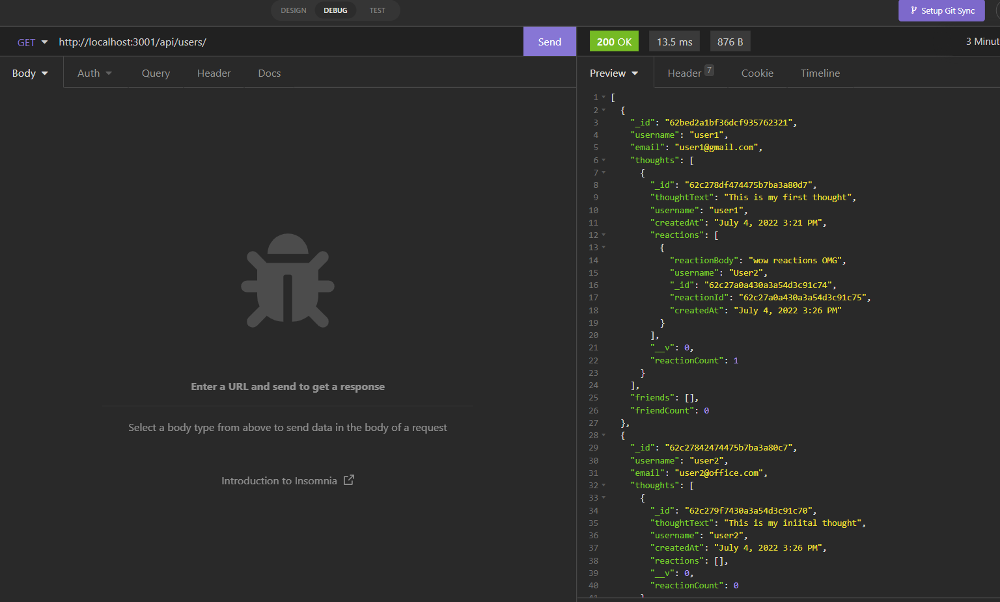
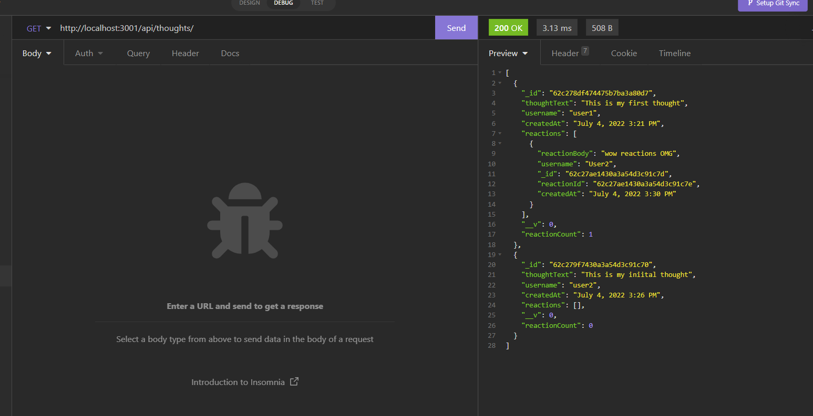

# NoSQL-Social-Network-API

An API for a social network web application where users can share their thoughts, react to friends’ thoughts, and create a friend list

## 

# Functionality of this app

An API for a social network web application with different routes to get, create, update and delete Users and Thoughts. Database is connected with local MongoDB compass.

# Installation

- Download or clone repository.
- Node.js is required to run the application
- npm install to install the required packages as per package.json

# Usage

- Start the server in Node JS and can run all the routes in Insomnia.

# Application Demo

## Please click on the link for video demo below

## [Social Network API](https://drive.google.com/file/d/1Um5eW8q-2_ecHuoaZBw3onwbk9TGZA-F/view)

# Below are the sample pages of command line application

# Features and Technologies uses

- JavaScript
- Node.js
- Express.js
- Mongoose

## Under the MIT license

